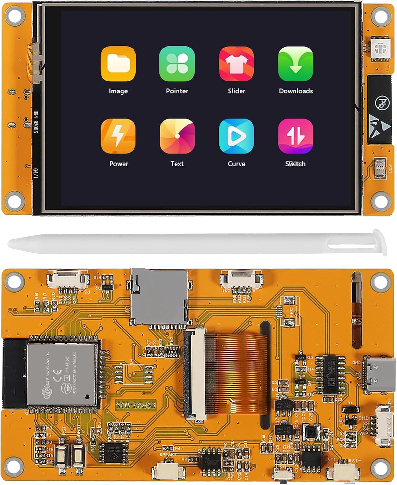
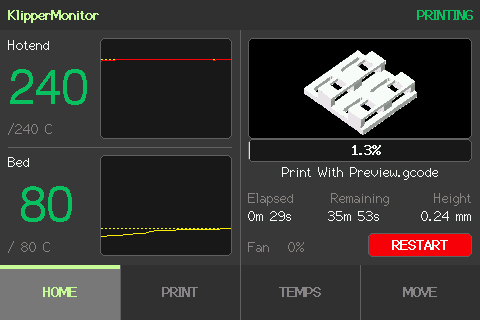
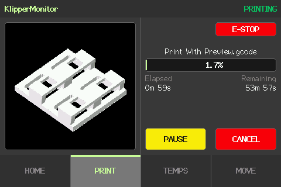
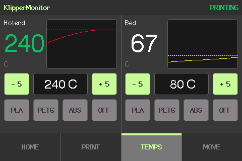
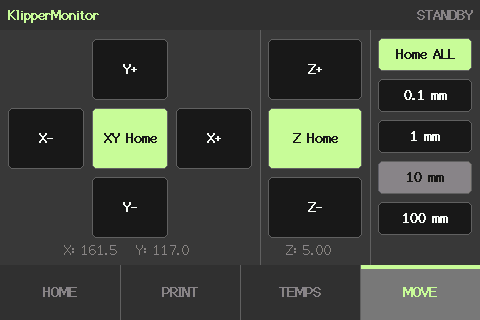
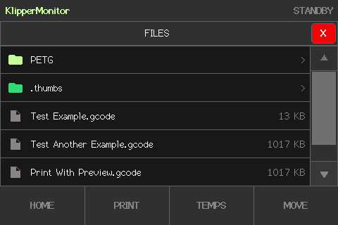
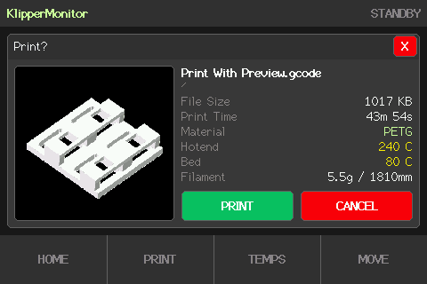

# Klipper Monitor for CYD 3.5" Resistive

A simple Klipper Monitor for CYD 3.5" Resistive using Moonraker.

## Cheap Yellow Display 3.5" Resistive

- Display : ST7796 480×320
- Touch : XPT2046 resistive
- [Conections](assets/connections.png)



## Screenshots

|                          |                            |                                            |
| ------------------------ | -------------------------- | ------------------------------------------ |
|  |  |                  |
|  |  |  |

## Dependencies

- TFT_eSPI (by Bodmer)
- ArduinoJson (by Benoit Blanchon)

## Settings

Edit the file `config.h` before to build, it's necessary to setup wi-fi, ip, etc.

## Take Screenshots

To capture the device screen as a `.png` file over Serial:

### 1. Enable DEBUG mode

In `config.h`, make sure the `DEBUG` macro is defined:

```cpp
#define DEBUG
```

Compile and upload the firmware. No additional changes to the sketch are required — the serial command listener is included automatically.

### 2. Install the Python dependency

```bash
pip install pyserial
```

### 3. Run the capture script

With the device connected and the firmware running, execute:

```bash
python screenshot.py /dev/ttyUSB0 921600 folder/screenshot.png
```

Replace the port according to your system (`COM3` on Windows, `/dev/ttyUSB0` on Linux/macOS). The filename is optional — if omitted, a timestamp will be used.

> **Note:** Do not open the Arduino IDE Serial Monitor while the script is running — they cannot both use the serial port at the same time.
